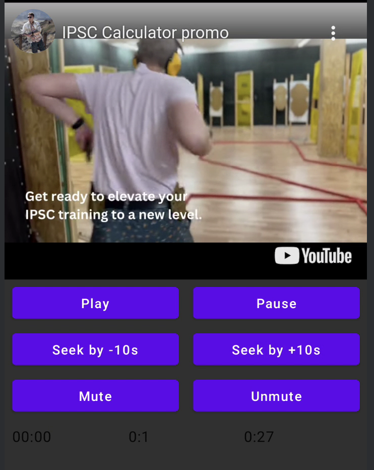

# YouTubePlayer

[](https://central.sonatype.com/artifact/io.github.ilyapavlovskii/youtubeplayer-compose)
[](http://kotlinlang.org)
[](https://github.com/JetBrains/compose-multiplatform)


YouTube kotlin multiplatform player.
The `YouTubePlayer` composable allows you to embed a YouTube video player in your Jetpack Compose app.

## Donate
If you want to thank me or contribute to the development of the backlog, you may donate me. That helps me to concentrate more on the project.

[](https://www.paypal.com/paypalme/ipavlovskii)
[](https://www.buymeacoffee.com/ipavlovskii)

You also might subscribe me on the next platforms to see any updates of my topics

[](https://pavlovskiiilia.medium.com/)
[](https://habr.com/ru/users/TranE91/posts/)

# Install
You can add this library to your project using Gradle.

Multiplatform
To add to a multiplatform project, add the dependency to the common source-set:

```gradle
repositories {
    mavenCentral()
}

kotlin {
    sourceSets {
        commonMain {
            dependencies {
                implementation("io.github.ilyapavlovskii:youtubeplayer-compose:${latest_version}")
            }
        }
    }
}
```

# Usage

```kotlin
val execCommand = mutableStateOf<YouTubeExecCommand?>(null)
YouTubePlayer(
    modifier = Modifier
        .fillMaxWidth()
        .height(300.dp),
    options = SimpleYouTubePlayerOptionsBuilder.builder {
        autoplay(true) // autoplay = true 
        controls(false).rel(false) // controls = false, rel = false
        ivLoadPolicy(false)
        ccLoadPolicy(false)
        fullscreen = true
    },
    execCommandState = execCommand,
    actionListener = { action ->
        when (action) {
            YouTubeEvent.Ready -> {
                execCommand.value = YouTubeExecCommand.LoadVideo(
                    videoId = YouTubeVideoId("ufKj1sBrC4Q"),
                )
            }

            is YouTubeEvent.VideoDuration -> {
                videoDuration = formatTime(action.duration)
            }

            is YouTubeEvent.TimeChanged -> {
                currentTime = formatTime(action.time)
            }

            is YouTubeEvent.OnVideoIdHandled,
            is YouTubeEvent.Error,
            is YouTubeEvent.PlaybackQualityChange,
            is YouTubeEvent.RateChange,
            is YouTubeEvent.StateChanged,
            -> println("webViewState. onAction HANDlED: $action")
        }
    },
)
```

Composable function has the next major params:

* `options` - to player options builder. All parameters wrapped from [official youtube iframe documentation](https://developers.google.com/youtube/player_parameters#Parameters).
* `executeCommand/executeCommandFlow/executeCommandState` - [player command](#YouTubeExecCommand) to manage some actions of the YouTubePlayer. 
* `listener` - listener for YouTube events. Description [here](#YouTubeEvent)

### <a name="YouTubeExecCommand">YouTubeExecCommand</a>

* `LoadVideo(val videoId: YouTubeVideoId,val startSeconds: Duration)` - load video by youtube id. Possible to start with default start time offset.

* `Play` - play video
* `Pause` - pause video
* `SeekTo(val duration: Duration)` - seek video to a specified time
* `SeekBy(val duration: Duration)` - seek video by a specified time
* `Mute` - mute sound
* `Unmute` - unmute sound
* `SetVolume(val volumePercent: Int)` - set volume. Expected argument value from 0 to 100.
* `NextVideo` - navigate to a next video
* `PreviousVideo` - navigate to a previous video
* `SetLoop(val loop: Boolean)` - repeat video. Managed by argument.
* `SetShuffle(val shuffle: Boolean)` - shuffle videos. Managed by argument.

### <a name="YouTubeEvent">YouTubeEvent</a>

* `Ready` - calls when youtube player initialization complete
* `PlaybackQualityChange(val quality: Quality)` - calls when player quality changes
* `Error(val error: String)` - error handle event. See argument for details.
* `VideoDuration(val duration: Duration)` - calls when video duration initialized
* `StateChanged(val state: State)` - calls when video state changed: `UNSTARTED`,`ENDED`, `PLAYING`, `PAUSED`, `BUFFERING`, `CUED`.
* `TimeChanged(val time: Duration)` - timestamp changed
* `OnVideoIdHandled(val videoId: YouTubeVideoId)` - callback when video loaded

# Sample


# LICENSE

```
Copyright 2023 Ilia Pavlovskii

Licensed under the Apache License, Version 2.0 (the "License");
you may not use this file except in compliance with the License.
You may obtain a copy of the License at

    http://www.apache.org/licenses/LICENSE-2.0

Unless required by applicable law or agreed to in writing, software
distributed under the License is distributed on an "AS IS" BASIS,
WITHOUT WARRANTIES OR CONDITIONS OF ANY KIND, either express or implied.
See the License for the specific language governing permissions and
limitations under the License.
```